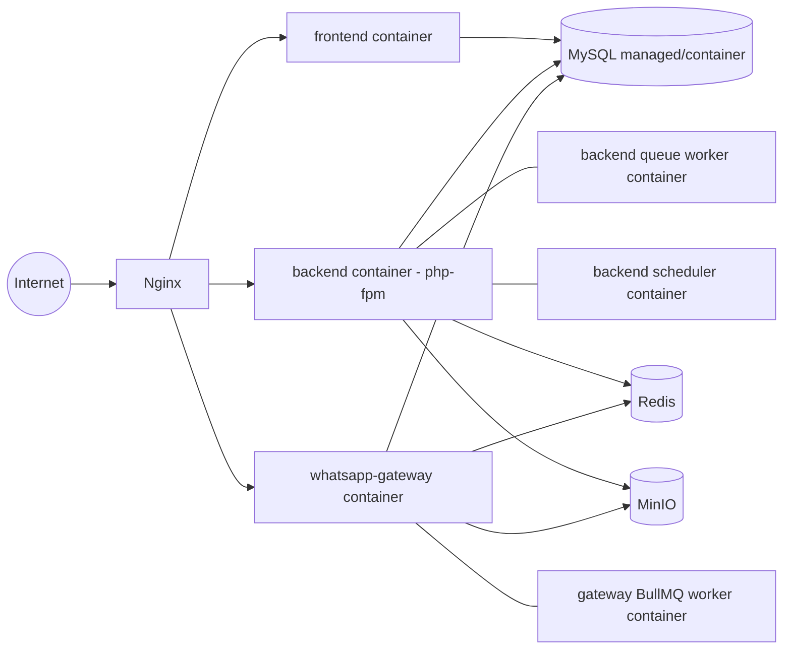

# 03 — System Architecture

## 1. Overview

The platform is three independently deployable services sharing one MySQL database and one
Redis instance, fronted by Nginx. The `whatsapp-gateway` owns the live connection to WhatsApp
(via Baileys, an unofficial multi-device Web protocol library) and is the only service that
talks to WhatsApp directly. The `backend` (Laravel) owns all CRM/business logic and is the
system of record for auth/RBAC/contacts/leads/deals/etc. The `frontend` (Next.js) is a pure
client of the backend REST API and of both services' Socket.IO namespaces.

## 2. Container Diagram

```mermaid
graph TD
    subgraph Client
        Browser["Browser (Agent / Admin)"]
    end

    subgraph Edge
        Nginx["Nginx\n(reverse proxy, TLS)"]
    end

    subgraph AppServices["Application Services"]
        FE["frontend\nNext.js 14 App Router"]
        BE["backend\nLaravel 12 REST API /api/v1"]
        GW["whatsapp-gateway\nNode + Express + Baileys"]
    end

    subgraph Async["Async / Realtime"]
        BullMQ["BullMQ queues\n(outbound send, media dl)"]
        SocketBE["Socket.IO\n(backend namespace: notifications, presence)"]
        SocketGW["Socket.IO\n(gateway namespace: messages, conn status)"]
    end

    subgraph Data["Data Layer"]
        MySQL[("MySQL 8+\nshared schema, owned tables per service")]
        Redis[("Redis\ncache + queue broker + Socket.IO adapter")]
        MinIO[("MinIO\nS3-compatible media storage")]
    end

    subgraph External
        WA["WhatsApp\n(multi-device protocol)"]
    end

    Browser -->|HTTPS| Nginx
    Nginx -->|"/ "| FE
    Nginx -->|"/api/v1"| BE
    Nginx -->|"/ws (gateway realtime)"| GW
    Browser -.->|Socket.IO client| SocketBE
    Browser -.->|Socket.IO client| SocketGW

    FE -->|REST fetch, TanStack Query| BE
    FE -.->|realtime subscribe| SocketBE
    FE -.->|realtime subscribe| SocketGW

    BE -->|internal HTTP + shared secret\n(send message, connection status)| GW
    GW -->|internal HTTP + shared secret\n(sync contact/lead hooks)| BE

    BE --> MySQL
    GW --> MySQL
    BE --> Redis
    GW --> Redis
    GW --> BullMQ
    BullMQ --> GW

    BE --> MinIO
    GW --> MinIO

    GW <-->|Baileys multi-device WS| WA

    SocketGW --> Redis
    SocketBE --> Redis
```

## 3. Component Responsibilities

### frontend (Next.js)
- Server components for initial data fetch (SEO not critical, but used for fast first paint of
  dashboard/inbox shells); client components for interactive inbox, kanban, forms.
- TanStack Query as the client cache/sync layer against `/api/v1`.
- Socket.IO client maintains two connections (or one multiplexed): backend namespace for
  CRM/notification events, gateway namespace for message/connection events — see
  `EVENT_CATALOG.md` for exact room/channel design.
- RHF + Zod for all forms; shared Zod schemas mirror backend Form Request validation rules.

### backend (Laravel 12)
- REST API under `/api/v1`, versioned so a `/api/v2` can be introduced later without breaking
  clients.
- Sanctum session/token auth; Gates/Policies for authorization; custom middleware
  (`EnsureWorkspaceContext`, `Permission:` middleware) attached to route groups.
- Eloquent models for CRM-owned tables (full read/write) and **read-only** Eloquent models
  (guarded — no `create`/`update`/`delete`, enforced via model-level guards and DB user grants)
  for gateway-owned tables, so Laravel can join/query WhatsApp data without duplicating writes.
- Emits domain Events (e.g. `LeadConverted`, `ConversationAssigned`) consumed by Listeners that
  create Notifications, write Audit Logs, and broadcast to Socket.IO via a lightweight internal
  broadcast bridge (Laravel Echo broadcaster → Redis → gateway's Socket.IO server relays, or
  backend runs its own minimal Socket.IO/websocket process — see decision in `DECISIONS.md`).
- Queued jobs (Laravel queue, Redis driver) for notification delivery, audit log writing under
  load, scheduled reminders.

### whatsapp-gateway (Node/TS)
- Owns the Baileys socket lifecycle: boot, QR generation, authentication, credential
  persistence, reconnection with backoff.
- Persists multi-device auth state (`whatsapp_session_credentials`) to MySQL instead of the
  filesystem so the gateway is restart-safe and (in future) horizontally movable.
- Inbound message pipeline: Baileys event → normalize → write `conversations`/`messages`/
  `message_media` → publish Socket.IO event → enqueue any derived work.
- Outbound message pipeline: API request or BullMQ job → Baileys send → `message_status_events`
  written as delivery/read receipts arrive.
- BullMQ queues: `outbound-messages` (send), `media-download` (fetch/store WhatsApp media into
  MinIO), `session-maintenance` (periodic checkpoint/backoff bookkeeping).
- Exposes a small internal HTTP API (`/internal/*`, shared-secret authenticated) for the backend
  to trigger sends and query connection status, and a Socket.IO server for realtime fan-out to
  the frontend.

## 4. Realtime Transport Decision

Two logical Socket.IO namespaces, both backed by the same Redis instance (via the Socket.IO
Redis adapter) so events can be published from either Node or PHP processes:

- `whatsapp-gateway` runs the actual Socket.IO server processes the frontend connects to for
  message/connection events (it's already Node, natural fit for Socket.IO).
- `backend` publishes CRM-domain realtime events (notifications, conversation assignment,
  presence, task reminders) onto a Redis pub/sub channel using a fixed message envelope; a thin
  bridge inside the gateway process subscribes to that channel and re-emits it on its Socket.IO
  server under a `crm` namespace. This avoids running two separate Socket.IO servers/ports and
  avoids adding a PHP websocket runtime (Reverb/Soketi) as a fourth long-running process. See
  `DECISIONS.md` for the trade-off discussion.

## 5. Room / Channel Naming Convention

See `EVENT_CATALOG.md` §2 for the full convention. Summary: every socket room is scoped by
`workspace:{workspaceId}:...` and further by entity (`conversation:{id}`, `user:{id}`).

## 6. Deployment Topology (prod)



Each box is a Docker Compose service in `infrastructure/docker-compose.prod.yml`. See
`10-deployment-plan.md`.
