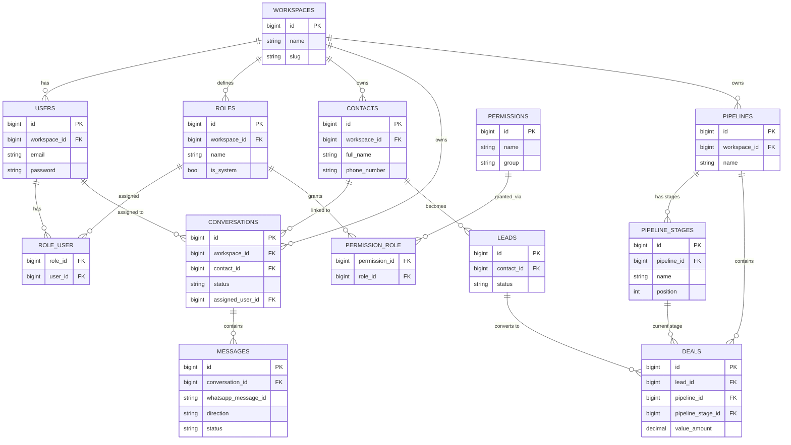

# 04 — Database Design

Single shared MySQL 8+ database (e.g. `crm_whatsapp`). All tenant-scoped tables carry
`workspace_id` (single workspace per deployment, but modeled explicitly so the constraint is
always enforced at the query layer and the schema stays portable). Ownership (which service
runs the migration and has write access) is marked per table; see `DATA_OWNERSHIP.md` for the
full rationale.

Conventions used below:
- `id BIGINT UNSIGNED PK AUTO_INCREMENT` on every table unless noted.
- `created_at`, `updated_at` = `TIMESTAMP NULL` (Laravel/Node both write these) on every table
  unless noted.
- `deleted_at TIMESTAMP NULL` = soft delete, marked "SOFT DELETES" per table.
- FK = `ON DELETE` behavior noted inline.

---

## 1. Workspace, Identity & RBAC (owner: **backend**)

### workspaces
| Column | Type | Notes |
|---|---|---|
| id | BIGINT UNSIGNED PK | |
| name | VARCHAR(255) | |
| slug | VARCHAR(255) UNIQUE | |
| whatsapp_number | VARCHAR(32) NULL | E.164, denormalized for quick display |
| timezone | VARCHAR(64) | default `UTC` |
| logo_path | VARCHAR(255) NULL | MinIO object key |
| is_active | BOOLEAN | default true |
| created_at, updated_at | TIMESTAMP | |

### workspace_settings
| Column | Type | Notes |
|---|---|---|
| id | BIGINT UNSIGNED PK | |
| workspace_id | BIGINT UNSIGNED FK → workspaces.id (CASCADE) UNIQUE | 1:1 |
| business_hours | JSON | |
| default_pipeline_id | BIGINT UNSIGNED NULL FK → pipelines.id (SET NULL) | |
| notification_defaults | JSON | |
| branding | JSON | color/logo overrides |
| created_at, updated_at | TIMESTAMP | |

### users — SOFT DELETES
| Column | Type | Notes |
|---|---|---|
| id | BIGINT UNSIGNED PK | |
| workspace_id | BIGINT UNSIGNED FK → workspaces.id (CASCADE) | |
| name | VARCHAR(255) | |
| email | VARCHAR(255) | UNIQUE(workspace_id, email) |
| email_verified_at | TIMESTAMP NULL | |
| password | VARCHAR(255) | hashed |
| avatar_path | VARCHAR(255) NULL | |
| is_active | BOOLEAN | default true |
| last_login_at | TIMESTAMP NULL | |
| created_at, updated_at, deleted_at | TIMESTAMP | |

### roles
| Column | Type | Notes |
|---|---|---|
| id | BIGINT UNSIGNED PK | |
| workspace_id | BIGINT UNSIGNED FK → workspaces.id (CASCADE) | |
| name | VARCHAR(100) | e.g. "Super Admin"; UNIQUE(workspace_id, name) |
| slug | VARCHAR(100) | e.g. `super-admin` |
| is_system | BOOLEAN | true for the 5 seeded roles (protects from deletion) |
| description | VARCHAR(255) NULL | |
| created_at, updated_at | TIMESTAMP | |

### permissions
| Column | Type | Notes |
|---|---|---|
| id | BIGINT UNSIGNED PK | |
| name | VARCHAR(150) UNIQUE | e.g. `contacts.view` (global catalog, not per-workspace) |
| group | VARCHAR(100) | e.g. `contacts`, for UI grouping |
| description | VARCHAR(255) NULL | |
| created_at, updated_at | TIMESTAMP | |

### role_user (pivot)
| Column | Type | Notes |
|---|---|---|
| role_id | BIGINT UNSIGNED FK → roles.id (CASCADE) | PK part 1 |
| user_id | BIGINT UNSIGNED FK → users.id (CASCADE) | PK part 2 |
| created_at | TIMESTAMP | |

### permission_role (pivot)
| Column | Type | Notes |
|---|---|---|
| permission_id | BIGINT UNSIGNED FK → permissions.id (CASCADE) | PK part 1 |
| role_id | BIGINT UNSIGNED FK → roles.id (CASCADE) | PK part 2 |
| created_at | TIMESTAMP | |

### teams
| Column | Type | Notes |
|---|---|---|
| id | BIGINT UNSIGNED PK | |
| workspace_id | BIGINT UNSIGNED FK → workspaces.id (CASCADE) | |
| name | VARCHAR(150) | UNIQUE(workspace_id, name) |
| description | VARCHAR(255) NULL | |
| created_at, updated_at | TIMESTAMP | |

### team_user (pivot)
| Column | Type | Notes |
|---|---|---|
| team_id | BIGINT UNSIGNED FK → teams.id (CASCADE) | PK part 1 |
| user_id | BIGINT UNSIGNED FK → users.id (CASCADE) | PK part 2 |
| is_lead | BOOLEAN | default false |
| created_at | TIMESTAMP | |

### invitations
| Column | Type | Notes |
|---|---|---|
| id | BIGINT UNSIGNED PK | |
| workspace_id | BIGINT UNSIGNED FK → workspaces.id (CASCADE) | |
| email | VARCHAR(255) | |
| role_id | BIGINT UNSIGNED FK → roles.id (CASCADE) | |
| invited_by | BIGINT UNSIGNED FK → users.id (SET NULL) NULL | |
| token | VARCHAR(100) UNIQUE | |
| status | ENUM('pending','accepted','expired','revoked') | default `pending` |
| expires_at | TIMESTAMP | |
| accepted_at | TIMESTAMP NULL | |
| created_at, updated_at | TIMESTAMP | |

---

## 2. WhatsApp Gateway Domain (owner: **whatsapp-gateway**)

### whatsapp_sessions
| Column | Type | Notes |
|---|---|---|
| id | BIGINT UNSIGNED PK | |
| workspace_id | BIGINT UNSIGNED FK → workspaces.id (CASCADE) UNIQUE | one session per workspace |
| status | ENUM('initializing','qr_pending','connected','disconnected','logged_out') | |
| phone_number | VARCHAR(32) NULL | linked number once connected |
| device_id | VARCHAR(64) NULL | Baileys device identifier |
| last_connected_at | TIMESTAMP NULL | |
| last_disconnected_at | TIMESTAMP NULL | |
| disconnect_reason | VARCHAR(255) NULL | |
| qr_code | TEXT NULL | current QR payload (base64/data-url), cleared once scanned |
| qr_expires_at | TIMESTAMP NULL | |
| created_at, updated_at | TIMESTAMP | |

### whatsapp_session_credentials
| Column | Type | Notes |
|---|---|---|
| id | BIGINT UNSIGNED PK | |
| whatsapp_session_id | BIGINT UNSIGNED FK → whatsapp_sessions.id (CASCADE) | |
| key_name | VARCHAR(100) | Baileys auth-state key (e.g. `creds`, `app-state-sync-key-...`) |
| value | LONGTEXT | encrypted JSON blob |
| created_at, updated_at | TIMESTAMP | UNIQUE(whatsapp_session_id, key_name) |

### whatsapp_connection_events
| Column | Type | Notes |
|---|---|---|
| id | BIGINT UNSIGNED PK | |
| workspace_id | BIGINT UNSIGNED FK → workspaces.id (CASCADE) | |
| whatsapp_session_id | BIGINT UNSIGNED FK → whatsapp_sessions.id (CASCADE) | |
| event_type | ENUM('qr_generated','connecting','connected','disconnected','reconnect_attempt','logged_out','error') | |
| metadata | JSON NULL | reconnect attempt #, error code/message |
| occurred_at | TIMESTAMP | |
| created_at | TIMESTAMP | |

### whatsapp_sync_checkpoints
| Column | Type | Notes |
|---|---|---|
| id | BIGINT UNSIGNED PK | |
| workspace_id | BIGINT UNSIGNED FK → workspaces.id (CASCADE) | |
| checkpoint_type | VARCHAR(64) | e.g. `history_sync`, `contacts_sync` |
| cursor | VARCHAR(255) NULL | opaque resume token |
| last_synced_at | TIMESTAMP NULL | |
| created_at, updated_at | TIMESTAMP | UNIQUE(workspace_id, checkpoint_type) |

### whatsapp_contacts
| Column | Type | Notes |
|---|---|---|
| id | BIGINT UNSIGNED PK | |
| workspace_id | BIGINT UNSIGNED FK → workspaces.id (CASCADE) | |
| wa_jid | VARCHAR(64) | WhatsApp JID, e.g. `2547...@s.whatsapp.net`; UNIQUE(workspace_id, wa_jid) |
| push_name | VARCHAR(255) NULL | WhatsApp display name |
| phone_number | VARCHAR(32) NULL | derived from JID |
| profile_picture_url | VARCHAR(500) NULL | |
| is_business | BOOLEAN | default false |
| contact_id | BIGINT UNSIGNED NULL FK → contacts.id (SET NULL) | link to CRM contact once merged |
| last_seen_at | TIMESTAMP NULL | |
| created_at, updated_at | TIMESTAMP | |

---

## 3. Conversations & Messaging (owner: **whatsapp-gateway**, CRM-enrichment fields owned by **backend**)

### conversations
| Column | Type | Notes |
|---|---|---|
| id | BIGINT UNSIGNED PK | |
| workspace_id | BIGINT UNSIGNED FK → workspaces.id (CASCADE) | |
| whatsapp_contact_id | BIGINT UNSIGNED FK → whatsapp_contacts.id (CASCADE) | gateway-owned |
| contact_id | BIGINT UNSIGNED NULL FK → contacts.id (SET NULL) | backend-owned enrichment |
| status | ENUM('open','pending','closed') | default `open` |
| assigned_user_id | BIGINT UNSIGNED NULL FK → users.id (SET NULL) | backend-owned |
| assigned_team_id | BIGINT UNSIGNED NULL FK → teams.id (SET NULL) | backend-owned |
| last_message_at | TIMESTAMP NULL | gateway-owned, updated per inbound/outbound message |
| last_message_preview | VARCHAR(255) NULL | gateway-owned |
| unread_count | INT UNSIGNED | default 0, gateway-owned |
| closed_at | TIMESTAMP NULL | backend-owned |
| closed_by | BIGINT UNSIGNED NULL FK → users.id (SET NULL) | backend-owned |
| created_at, updated_at | TIMESTAMP | |

> Split-ownership note: the gateway owns row creation and the WhatsApp-derived columns
> (`whatsapp_contact_id`, `last_message_at`, `last_message_preview`, `unread_count`); the backend
> owns the CRM-derived columns (`contact_id`, `assigned_user_id`, `assigned_team_id`, `status`,
> `closed_*`). Each service only ever updates its own column subset — see `DATA_OWNERSHIP.md`.

### conversation_assignments
| Column | Type | Notes |
|---|---|---|
| id | BIGINT UNSIGNED PK | |
| conversation_id | BIGINT UNSIGNED FK → conversations.id (CASCADE) | |
| assigned_to_user_id | BIGINT UNSIGNED NULL FK → users.id (SET NULL) | |
| assigned_to_team_id | BIGINT UNSIGNED NULL FK → teams.id (SET NULL) | |
| assigned_by | BIGINT UNSIGNED NULL FK → users.id (SET NULL) | |
| assigned_at | TIMESTAMP | |
| unassigned_at | TIMESTAMP NULL | history row closed when reassigned |
| created_at | TIMESTAMP | |

### conversation_participants
| Column | Type | Notes |
|---|---|---|
| id | BIGINT UNSIGNED PK | |
| conversation_id | BIGINT UNSIGNED FK → conversations.id (CASCADE) | |
| user_id | BIGINT UNSIGNED FK → users.id (CASCADE) | agents who have participated (replied/noted) |
| last_read_message_id | BIGINT UNSIGNED NULL FK → messages.id (SET NULL) | for read-state per user |
| last_read_at | TIMESTAMP NULL | |
| created_at, updated_at | TIMESTAMP | UNIQUE(conversation_id, user_id) |

### messages
| Column | Type | Notes |
|---|---|---|
| id | BIGINT UNSIGNED PK | |
| workspace_id | BIGINT UNSIGNED FK → workspaces.id (CASCADE) | |
| conversation_id | BIGINT UNSIGNED FK → conversations.id (CASCADE) | |
| whatsapp_message_id | VARCHAR(128) | Baileys/WhatsApp message id (`key.id`) |
| direction | ENUM('inbound','outbound') | |
| sender_type | ENUM('contact','user','system') | |
| sender_user_id | BIGINT UNSIGNED NULL FK → users.id (SET NULL) | set when direction=outbound and sender_type=user |
| message_type | ENUM('text','image','video','audio','document','sticker','location','contact_card','template','system') | |
| body | TEXT NULL | text content / caption |
| status | ENUM('queued','sent','delivered','read','failed') | |
| replied_to_message_id | BIGINT UNSIGNED NULL FK → messages.id (SET NULL) | quoted reply |
| is_deleted_for_everyone | BOOLEAN | default false |
| sent_at | TIMESTAMP NULL | |
| created_at, updated_at | TIMESTAMP | |

**Constraint:** `UNIQUE(workspace_id, whatsapp_message_id)` — mandatory dedup key.

### message_media
| Column | Type | Notes |
|---|---|---|
| id | BIGINT UNSIGNED PK | |
| message_id | BIGINT UNSIGNED FK → messages.id (CASCADE) | |
| mime_type | VARCHAR(100) | |
| file_size_bytes | BIGINT UNSIGNED NULL | |
| storage_path | VARCHAR(500) | MinIO object key |
| thumbnail_path | VARCHAR(500) NULL | |
| duration_seconds | INT UNSIGNED NULL | audio/video |
| width | INT UNSIGNED NULL | |
| height | INT UNSIGNED NULL | |
| checksum_sha256 | VARCHAR(64) NULL | |
| created_at, updated_at | TIMESTAMP | |

### message_status_events
| Column | Type | Notes |
|---|---|---|
| id | BIGINT UNSIGNED PK | |
| message_id | BIGINT UNSIGNED FK → messages.id (CASCADE) | |
| status | ENUM('queued','sent','delivered','read','failed') | |
| occurred_at | TIMESTAMP | |
| raw_payload | JSON NULL | original Baileys receipt payload for debugging |
| created_at | TIMESTAMP | |

### message_reactions
| Column | Type | Notes |
|---|---|---|
| id | BIGINT UNSIGNED PK | |
| message_id | BIGINT UNSIGNED FK → messages.id (CASCADE) | |
| whatsapp_contact_id | BIGINT UNSIGNED NULL FK → whatsapp_contacts.id (SET NULL) | reactor if contact |
| user_id | BIGINT UNSIGNED NULL FK → users.id (SET NULL) | reactor if agent |
| emoji | VARCHAR(16) | |
| reacted_at | TIMESTAMP | |
| created_at, updated_at | TIMESTAMP | UNIQUE(message_id, whatsapp_contact_id, user_id) |

### message_dispatch_queue
| Column | Type | Notes |
|---|---|---|
| id | BIGINT UNSIGNED PK | |
| workspace_id | BIGINT UNSIGNED FK → workspaces.id (CASCADE) | |
| conversation_id | BIGINT UNSIGNED FK → conversations.id (CASCADE) | |
| requested_by_user_id | BIGINT UNSIGNED NULL FK → users.id (SET NULL) | |
| payload | JSON | message content/type to send |
| bullmq_job_id | VARCHAR(100) NULL | correlate to BullMQ job |
| status | ENUM('pending','processing','sent','failed') | default `pending` |
| attempts | INT UNSIGNED | default 0 |
| message_id | BIGINT UNSIGNED NULL FK → messages.id (SET NULL) | set once persisted |
| created_at, updated_at | TIMESTAMP | |

### message_processing_failures
| Column | Type | Notes |
|---|---|---|
| id | BIGINT UNSIGNED PK | |
| workspace_id | BIGINT UNSIGNED FK → workspaces.id (CASCADE) | |
| message_dispatch_queue_id | BIGINT UNSIGNED NULL FK → message_dispatch_queue.id (SET NULL) | |
| conversation_id | BIGINT UNSIGNED NULL FK → conversations.id (SET NULL) | |
| stage | ENUM('validation','send','media_download','persist') | |
| error_message | TEXT | |
| error_context | JSON NULL | |
| created_at | TIMESTAMP | |

---

## 4. CRM Domain (owner: **backend**)

### contacts — SOFT DELETES
| Column | Type | Notes |
|---|---|---|
| id | BIGINT UNSIGNED PK | |
| workspace_id | BIGINT UNSIGNED FK → workspaces.id (CASCADE) | |
| whatsapp_contact_id | BIGINT UNSIGNED NULL FK → whatsapp_contacts.id (SET NULL) | reverse link |
| full_name | VARCHAR(255) NULL | |
| email | VARCHAR(255) NULL | |
| company | VARCHAR(255) NULL | |
| job_title | VARCHAR(150) NULL | |
| phone_number | VARCHAR(32) NULL | |
| custom_fields | JSON NULL | |
| owner_user_id | BIGINT UNSIGNED NULL FK → users.id (SET NULL) | |
| created_at, updated_at, deleted_at | TIMESTAMP | |

### pipelines
| Column | Type | Notes |
|---|---|---|
| id | BIGINT UNSIGNED PK | |
| workspace_id | BIGINT UNSIGNED FK → workspaces.id (CASCADE) | |
| name | VARCHAR(150) | UNIQUE(workspace_id, name) |
| is_default | BOOLEAN | default false |
| created_at, updated_at | TIMESTAMP | |

### pipeline_stages
| Column | Type | Notes |
|---|---|---|
| id | BIGINT UNSIGNED PK | |
| pipeline_id | BIGINT UNSIGNED FK → pipelines.id (CASCADE) | |
| name | VARCHAR(100) | |
| position | INT UNSIGNED | ordering for kanban columns |
| probability_percent | TINYINT UNSIGNED NULL | for forecasting |
| is_won_stage | BOOLEAN | default false |
| is_lost_stage | BOOLEAN | default false |
| created_at, updated_at | TIMESTAMP | UNIQUE(pipeline_id, position) |

### leads — SOFT DELETES
| Column | Type | Notes |
|---|---|---|
| id | BIGINT UNSIGNED PK | |
| workspace_id | BIGINT UNSIGNED FK → workspaces.id (CASCADE) | |
| contact_id | BIGINT UNSIGNED FK → contacts.id (CASCADE) | |
| conversation_id | BIGINT UNSIGNED NULL FK → conversations.id (SET NULL) | source conversation |
| source | ENUM('whatsapp','manual','import','other') | default `whatsapp` |
| status | ENUM('new','contacted','qualified','disqualified','converted') | default `new` |
| owner_user_id | BIGINT UNSIGNED NULL FK → users.id (SET NULL) | |
| notes | TEXT NULL | |
| created_at, updated_at, deleted_at | TIMESTAMP | |

### deals — SOFT DELETES
| Column | Type | Notes |
|---|---|---|
| id | BIGINT UNSIGNED PK | |
| workspace_id | BIGINT UNSIGNED FK → workspaces.id (CASCADE) | |
| lead_id | BIGINT UNSIGNED NULL FK → leads.id (SET NULL) | |
| contact_id | BIGINT UNSIGNED FK → contacts.id (CASCADE) | |
| pipeline_id | BIGINT UNSIGNED FK → pipelines.id (CASCADE) | |
| pipeline_stage_id | BIGINT UNSIGNED FK → pipeline_stages.id (CASCADE) | |
| title | VARCHAR(255) | |
| value_amount | DECIMAL(14,2) NULL | |
| value_currency | CHAR(3) | default `USD` |
| owner_user_id | BIGINT UNSIGNED NULL FK → users.id (SET NULL) | |
| expected_close_date | DATE NULL | |
| status | ENUM('open','won','lost') | default `open` |
| created_at, updated_at, deleted_at | TIMESTAMP | |

### deal_stage_history
| Column | Type | Notes |
|---|---|---|
| id | BIGINT UNSIGNED PK | |
| deal_id | BIGINT UNSIGNED FK → deals.id (CASCADE) | |
| from_stage_id | BIGINT UNSIGNED NULL FK → pipeline_stages.id (SET NULL) | |
| to_stage_id | BIGINT UNSIGNED FK → pipeline_stages.id (CASCADE) | |
| moved_by | BIGINT UNSIGNED NULL FK → users.id (SET NULL) | |
| moved_at | TIMESTAMP | |
| created_at | TIMESTAMP | |

### contact_activities
| Column | Type | Notes |
|---|---|---|
| id | BIGINT UNSIGNED PK | |
| workspace_id | BIGINT UNSIGNED FK → workspaces.id (CASCADE) | |
| contact_id | BIGINT UNSIGNED FK → contacts.id (CASCADE) | |
| activity_type | ENUM('message','note','task','deal_change','lead_change','call','meeting','other') | |
| subject_type | VARCHAR(100) NULL | polymorphic reference type (e.g. `Deal`, `Task`) |
| subject_id | BIGINT UNSIGNED NULL | polymorphic reference id |
| description | VARCHAR(500) NULL | |
| occurred_at | TIMESTAMP | |
| created_by | BIGINT UNSIGNED NULL FK → users.id (SET NULL) | |
| created_at | TIMESTAMP | |

### internal_notes
| Column | Type | Notes |
|---|---|---|
| id | BIGINT UNSIGNED PK | |
| workspace_id | BIGINT UNSIGNED FK → workspaces.id (CASCADE) | |
| conversation_id | BIGINT UNSIGNED NULL FK → conversations.id (CASCADE) | |
| contact_id | BIGINT UNSIGNED NULL FK → contacts.id (CASCADE) | |
| deal_id | BIGINT UNSIGNED NULL FK → deals.id (CASCADE) | |
| author_id | BIGINT UNSIGNED FK → users.id (CASCADE) | |
| body | TEXT | |
| is_private | BOOLEAN | default false; gated by `notes.view_private` |
| created_at, updated_at | TIMESTAMP | |

### note_mentions
| Column | Type | Notes |
|---|---|---|
| id | BIGINT UNSIGNED PK | |
| internal_note_id | BIGINT UNSIGNED FK → internal_notes.id (CASCADE) | |
| mentioned_user_id | BIGINT UNSIGNED FK → users.id (CASCADE) | |
| notified_at | TIMESTAMP NULL | |
| created_at | TIMESTAMP | UNIQUE(internal_note_id, mentioned_user_id) |

### tasks — SOFT DELETES
| Column | Type | Notes |
|---|---|---|
| id | BIGINT UNSIGNED PK | |
| workspace_id | BIGINT UNSIGNED FK → workspaces.id (CASCADE) | |
| title | VARCHAR(255) | |
| description | TEXT NULL | |
| assignee_id | BIGINT UNSIGNED NULL FK → users.id (SET NULL) | |
| created_by | BIGINT UNSIGNED NULL FK → users.id (SET NULL) | |
| contact_id | BIGINT UNSIGNED NULL FK → contacts.id (SET NULL) | |
| lead_id | BIGINT UNSIGNED NULL FK → leads.id (SET NULL) | |
| deal_id | BIGINT UNSIGNED NULL FK → deals.id (SET NULL) | |
| conversation_id | BIGINT UNSIGNED NULL FK → conversations.id (SET NULL) | |
| due_at | TIMESTAMP NULL | |
| priority | ENUM('low','medium','high','urgent') | default `medium` |
| status | ENUM('open','in_progress','done','cancelled') | default `open` |
| completed_at | TIMESTAMP NULL | |
| created_at, updated_at, deleted_at | TIMESTAMP | |

### task_comments
| Column | Type | Notes |
|---|---|---|
| id | BIGINT UNSIGNED PK | |
| task_id | BIGINT UNSIGNED FK → tasks.id (CASCADE) | |
| author_id | BIGINT UNSIGNED FK → users.id (CASCADE) | |
| body | TEXT | |
| created_at, updated_at | TIMESTAMP | |

### task_reminders
| Column | Type | Notes |
|---|---|---|
| id | BIGINT UNSIGNED PK | |
| task_id | BIGINT UNSIGNED FK → tasks.id (CASCADE) | |
| remind_at | TIMESTAMP | |
| channel | ENUM('in_app','email','both') | default `in_app` |
| sent_at | TIMESTAMP NULL | |
| created_at, updated_at | TIMESTAMP | |

### labels
| Column | Type | Notes |
|---|---|---|
| id | BIGINT UNSIGNED PK | |
| workspace_id | BIGINT UNSIGNED FK → workspaces.id (CASCADE) | |
| name | VARCHAR(100) | UNIQUE(workspace_id, name) |
| color_hex | CHAR(7) | e.g. `#16A34A` |
| created_at, updated_at | TIMESTAMP | |

### contact_label / conversation_label / lead_label / deal_label (pivots)
Each has the same shape:
| Column | Type | Notes |
|---|---|---|
| label_id | BIGINT UNSIGNED FK → labels.id (CASCADE) | PK part 1 |
| {entity}_id | BIGINT UNSIGNED FK → {entity}s.id (CASCADE) | PK part 2 |
| created_at | TIMESTAMP | |

(`contact_label.contact_id`, `conversation_label.conversation_id`, `lead_label.lead_id`,
`deal_label.deal_id`.)

### notifications
| Column | Type | Notes |
|---|---|---|
| id | BIGINT UNSIGNED PK (or UUID per Laravel default notifications table) | |
| workspace_id | BIGINT UNSIGNED FK → workspaces.id (CASCADE) | |
| user_id | BIGINT UNSIGNED FK → users.id (CASCADE) | recipient |
| type | VARCHAR(150) | e.g. `ConversationAssigned`, `TaskDue` |
| data | JSON | payload for rendering |
| read_at | TIMESTAMP NULL | |
| created_at, updated_at | TIMESTAMP | |

### notification_preferences
| Column | Type | Notes |
|---|---|---|
| id | BIGINT UNSIGNED PK | |
| user_id | BIGINT UNSIGNED FK → users.id (CASCADE) | |
| notification_type | VARCHAR(150) | |
| in_app_enabled | BOOLEAN | default true |
| email_enabled | BOOLEAN | default false |
| created_at, updated_at | TIMESTAMP | UNIQUE(user_id, notification_type) |

### audit_logs
| Column | Type | Notes |
|---|---|---|
| id | BIGINT UNSIGNED PK | |
| workspace_id | BIGINT UNSIGNED FK → workspaces.id (CASCADE) | |
| user_id | BIGINT UNSIGNED NULL FK → users.id (SET NULL) | actor, null = system |
| action | VARCHAR(150) | e.g. `role.updated`, `contact.deleted` |
| subject_type | VARCHAR(100) NULL | |
| subject_id | BIGINT UNSIGNED NULL | |
| changes | JSON NULL | before/after diff |
| ip_address | VARCHAR(45) NULL | |
| user_agent | VARCHAR(255) NULL | |
| created_at | TIMESTAMP | |

### user_presence
| Column | Type | Notes |
|---|---|---|
| id | BIGINT UNSIGNED PK | |
| user_id | BIGINT UNSIGNED FK → users.id (CASCADE) UNIQUE | |
| status | ENUM('online','away','offline') | default `offline` |
| last_active_at | TIMESTAMP NULL | |
| created_at, updated_at | TIMESTAMP | |

### saved_filters
| Column | Type | Notes |
|---|---|---|
| id | BIGINT UNSIGNED PK | |
| workspace_id | BIGINT UNSIGNED FK → workspaces.id (CASCADE) | |
| user_id | BIGINT UNSIGNED FK → users.id (CASCADE) | |
| entity_type | ENUM('contacts','conversations','leads','deals','tasks') | |
| name | VARCHAR(150) | |
| filter_json | JSON | |
| is_shared | BOOLEAN | default false |
| created_at, updated_at | TIMESTAMP | |

### failed_jobs (Laravel standard)
| Column | Type | Notes |
|---|---|---|
| id | BIGINT UNSIGNED PK | |
| uuid | VARCHAR(255) UNIQUE | |
| connection | TEXT | |
| queue | TEXT | |
| payload | LONGTEXT | |
| exception | LONGTEXT | |
| failed_at | TIMESTAMP | default CURRENT_TIMESTAMP |

### jobs (Laravel standard queue table)
| Column | Type | Notes |
|---|---|---|
| id | BIGINT UNSIGNED PK | |
| queue | VARCHAR(255) | indexed |
| payload | LONGTEXT | |
| attempts | TINYINT UNSIGNED | |
| reserved_at | INT UNSIGNED NULL | |
| available_at | INT UNSIGNED | |
| created_at | INT UNSIGNED | |

---

## 5. ER Diagram (core subset)

## 6. Indexing Notes

- `messages`: composite index `(conversation_id, created_at)` for chat pagination; unique
  `(workspace_id, whatsapp_message_id)` for dedup (mandatory).
- `conversations`: index `(workspace_id, status, last_message_at)` for inbox list sort/filter;
  index `(assigned_user_id)`.
- `contacts`: index `(workspace_id, phone_number)`, `(workspace_id, email)`.
- `audit_logs`: index `(workspace_id, created_at)`, `(subject_type, subject_id)`.
- `notifications`: index `(user_id, read_at)`.
- `deal_stage_history`, `whatsapp_connection_events`, `message_status_events`: append-only,
  index by parent FK + timestamp for timeline queries.
