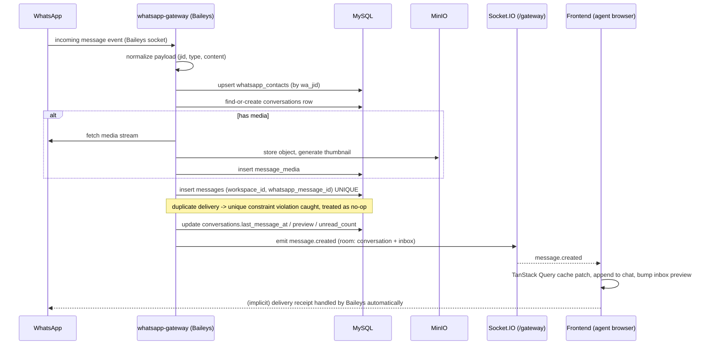
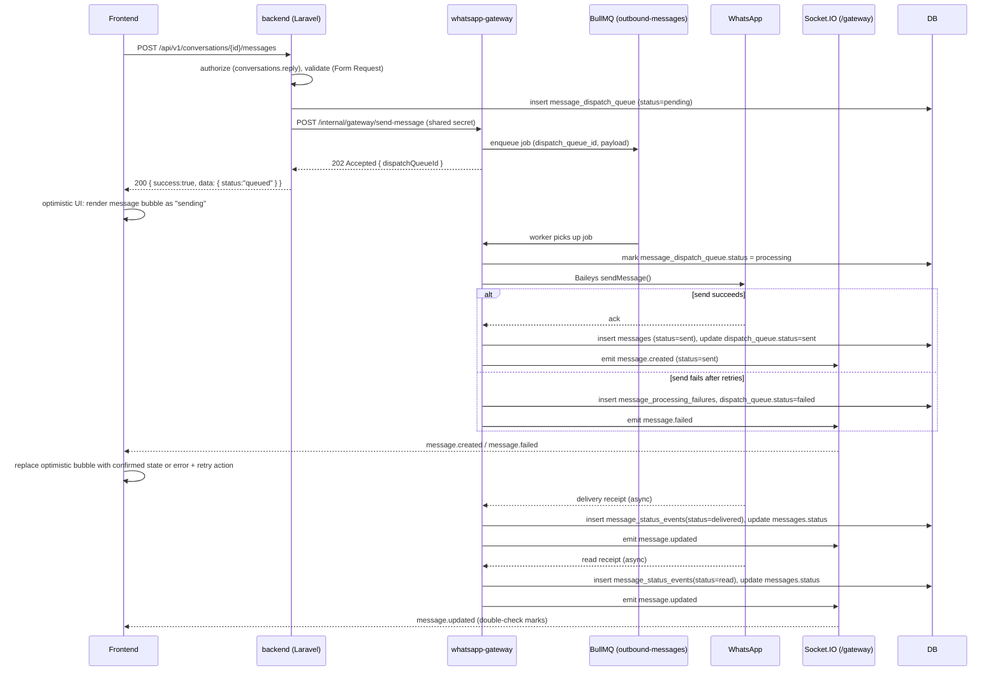
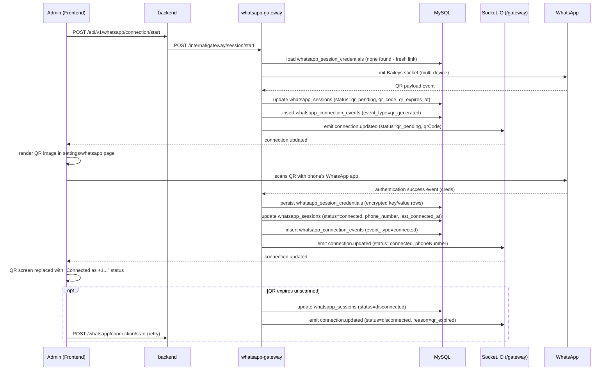
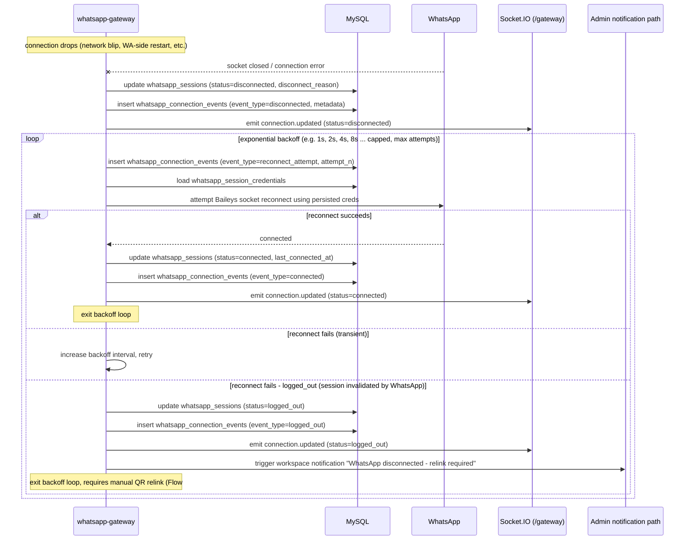

# 11 — Key Flows

Five core sequence/flow diagrams referenced throughout this documentation set.

## 1. Incoming Message Lifecycle

WhatsApp → gateway → DB → socket → frontend.



## 2. Outgoing Message Lifecycle

Frontend → backend/gateway → BullMQ → Baileys → WhatsApp → status updates.



## 3. QR Connection Lifecycle

Gateway boot → QR generated → scanned → authenticated → session persisted.



## 4. Lead Conversion Flow

Conversation/contact → lead → deal → pipeline stage.

```mermaid
flowchart TD
    A[Inbound WhatsApp conversation] --> B{Contact linked to CRM contact?}
    B -- No --> C[Agent merges whatsapp_contact -> contacts\nPOST /contacts/{id}/merge]
    B -- Yes --> D[Existing contacts row]
    C --> D
    D --> E[Agent creates Lead\nPOST /leads\n{contact_id, conversation_id, source: whatsapp}]
    E --> F[Lead status: new]
    F --> G[Manager/Agent qualifies\nPATCH /leads/{id} status=qualified]
    G --> H[Convert Lead to Deal\nPOST /leads/{id}/convert]
    H --> I[deals row created\nlead_id, contact_id, pipeline_id, pipeline_stage_id = first stage]
    H --> J[leads.status = converted]
    I --> K[deal_stage_history row inserted\nfrom_stage=null, to_stage=first stage]
    K --> L[Deal appears on kanban board]
    L --> M{Agent drags card to next stage}
    M --> N[PATCH /deals/{id}/stage]
    N --> O[deals.pipeline_stage_id updated]
    N --> P[deal_stage_history row inserted\nfrom_stage, to_stage, moved_by, moved_at]
    O --> Q{Stage is_won_stage or is_lost_stage?}
    Q -- won --> R[deals.status = won]
    Q -- lost --> S[deals.status = lost]
    Q -- neither --> L
```

## 5. Reconnection Flow

Session credential reload → reconnect attempt → backoff → connection event logged.


